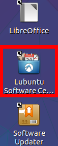
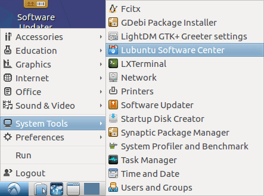

# Where to locate Lubuntu software center.

The Lubuntu software center can be found on your ``desktop``, and in your 
``start menu``.

## Desktop:

## Start menu:

## What the Lubuntu software center looks like:
