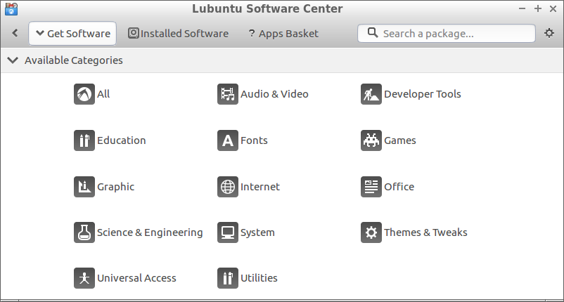

# Where to locate Lubuntu software center.

The Lubuntu software center can be found on your ``desktop``, and in your
``start menu``.

## Desktop:

## Start menu:

## What the Lubuntu software center looks like:

The Lubuntu software center is organized into categories.

### Categories

- ``All``
  - An unsorted category where you can find all software.
- ``Audio & Video``
  - Software related to playing videos, and music, as well as the production and editing of music and video.
  - E.g. ``VLC`` a media player.
- ``Developer Tools``
  - Software related to the creation of other software, web pages, and other things.
  - E.g. ``Geany`` A fast and lightweight IDE.
- ``Education``
  - Software related to education.
  - E.g. ``Kanagram`` a KDE letter order game.
- ``Fonts``
  - Where you can install other fonts.
  - E.g. the dosis font.
- ``Games``
  - Where you can download games.
  - E.g. ``Penguin golf`` a suite of penguin-themed solitaire games.
- ``Graphic``
  - Software related to image viewing, editing, and creating.
  - E.g. ``GIMP`` an application for creating images and editing photos.
- ``Internet``
  - Software related to using the Internet, and your network.
  - E.g. ``Google Chrome`` a popular web browser.
- ``Office``
  - Software related to office productivity.
  - E.g. the ``Libre office`` suite, a free alternative to Microsoft Office.
    - Don't expect the same experience.
- ``Science & Engineering``
  - Software related to science and engineering.
  - E.g. ``ACM`` a Biomolecular simulator.
- ``System``
  - Software related to managing your computer, or peripherals.
  - E.g. ``Gparted`` a graphical application for managing partitions.
- ``Themes & Tweaks``
  - Various themes, addons, etc for your desktop.
  - E.g. ``About me`` an application that allows you to edit personal details attached to your account.
- ``Unverisal Access``
  - Software for computers that aids people with special access needs.
  - E.g. ``Screen reader`` provides use of graphical desktops via synthesized speech and/or refreshable braille.
- ``Utilities``
  - Software related to studying, configuring, and maintaining your computer.
  - E.g. ``Archive manager`` for creating various formats of archives.
    - E.g. zip, tar.gz, rar, 7zip, etc.
