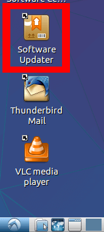
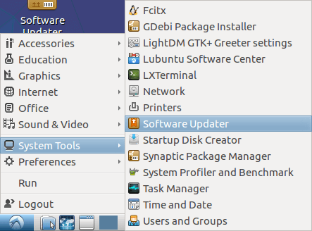

# Installing updates

Keeping software up to date is important for various reasons, such as, security,
reliability, and stability. Keeping software up to date on lubuntu is fairly
easy. Most of the time when software wants to update, a window will appear
to notify you, Though if you want to check for updates yourself,
the process is fairly easy.

You can click on the ``Software Updater`` icon on your desktop,

or you can find it in the ``start menu``.

If you let lubuntu tell you when to update, you'll see this:

to get more information, you can click the arrow before ``Details of updates``.

This will show a list of software that is going to be updated.

To install updates, press the ``Install Now`` Button. During the installation,
the program may prompt you for a password, this password is the smae one you
use to login to your account.

The next window you should see is:

and after that:

If you need to reboot, the final window tell have a ``Reboot`` button,
and the program will tell you, you need to reboot.
