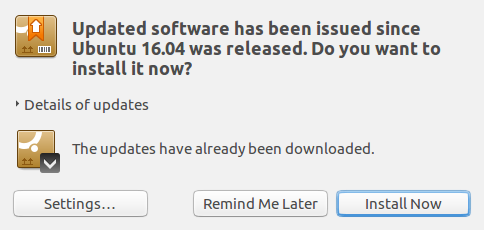
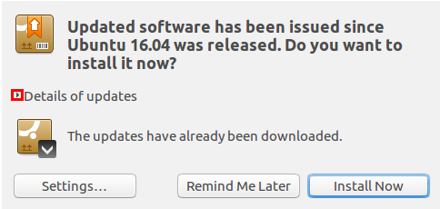
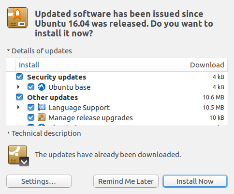

# Updates

## Keeping software up to date

Keeping software up to date is important for various reasons, such as, security,
reliability, and stability. Keeping software up to date on lubuntu is fairly 
easy.

Most of the time when software wants to update, this window will appear, to get
more information, you can click the arrow before ``Details of updates``.

This will show a list of software that is going to be updated.

