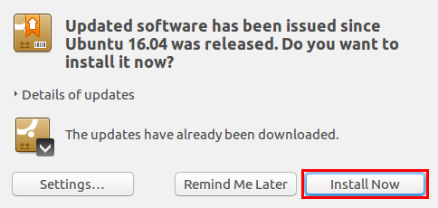
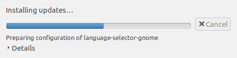
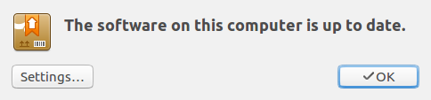

# Installing updates

Keeping software up to date is important for various reasons, such as, security,
reliability, and stability. Keeping software up to date on lubuntu is fairly
easy.

Most of the time when software wants to update, this window will appear, to get
more information, you can click the arrow before ``Details of updates``.

This will show a list of software that is going to be updated.

To install updates, press the ``Install Now`` Button. During the installation,
the program may prompt you for a password, this password is the smae one you
use to login to your account.

The next window you should see is:

and after that:

If you need to reboot, the final window tell have a ``Reboot`` button,
and the program will tell you, you need to reboot.
